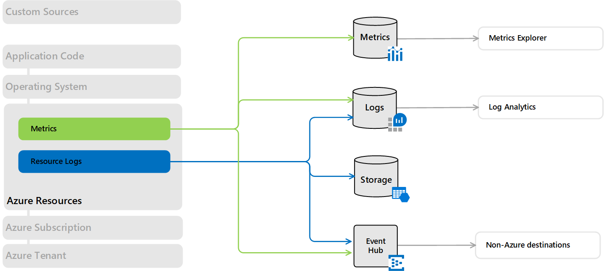
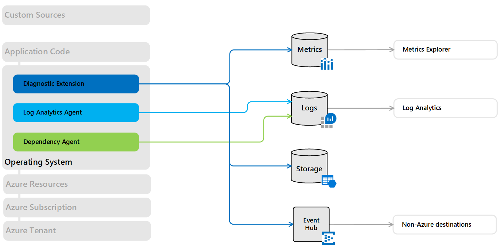
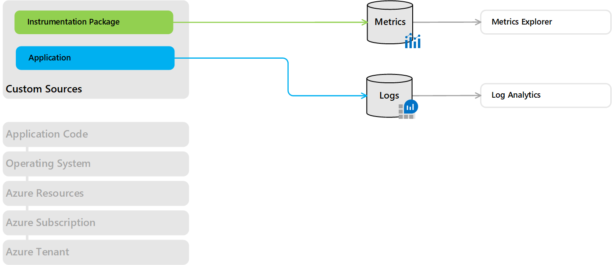

# Design Monitoring (10-15%)

## Design for cost optimization

#### Recommend a solution for cost management and cost reporting

Cost estimation tools:

- [TCO Calculator](https://azure.microsoft.com/en-us/pricing/tco/calculator/)
- [Azure Pricing Calculator](https://azure.microsoft.com/en-us/pricing/calculator/)
- [Azure Cost Management](https://docs.microsoft.com/en-us/azure/cost-management-billing/)
- [Azure Migrate](https://docs.microsoft.com/en-us/azure/migrate/concepts-assessment-calculation#how-do-i-run-an-assessment)
- [CosmosDB Sizing Calculator](https://docs.microsoft.com/en-us/azure/cosmos-db/estimate-ru-with-capacity-planner)
- [Azure Site Recovery Deployment Planner](https://aka.ms/asr-deployment-planner-doc)
- [Azure Hybrid Benefit Savings Calculator](https://azure.microsoft.com/en-us/pricing/hybrid-benefit/#ahub-calculator)

Consider the following methods of purchasing Azure and ways of modifying your pricing

- [Enterprise Agreement](https://docs.microsoft.com/en-us/azure/cost-management-billing/manage/ea-pricing)
- [Enterprise Dev Test Subscription](https://azure.microsoft.com/en-us/offers/ms-azr-0148p/)
  - Ideal for teams, multiple subscriptions allowed
  - Special lower Dev/Test rates on Windows Virtual Machines, Cloud Services, SQL Database, HDInsight, App Service and Logic Apps
  - No additional charge for using Visual Studio software
  - No SLA
- [Cloud Service Provider (Partner Program)](https://azure.microsoft.com/en-us/offers/ms-azr-0145p/)
  - Azure in CSP pricing is specific to the services consumed. Detailed pricing for Azure services is available to partners via the Partner Center Pricing and Offers page or via the [RateCard API](https://msdn.microsoft.com/library/partnercenter/mt427350.aspx).
- [Azure Hybrid Benefit for Windows Server](https://docs.microsoft.com/en-us/azure/virtual-machines/windows/hybrid-use-benefit-licensing)
  - For customers with Software Assurance
  - Azure Hybrid Benefit for Windows Server allows you to use your on-premises Windows Server licenses and run Windows virtual machines on Azure at a reduced cost
  - Each 2-processor license or each set of 16-core licenses are entitled to two instances of up to 8 cores, or one instance of up to 16 cores.
  - There are few ways to use Windows virtual machines with the Azure Hybrid Benefit:
    1. You can deploy VMs from one of the provided Windows Server images on the Azure Marketplace
    2. You can upload a custom VM and deploy using a Resource Manager template or Azure PowerShell
    3. You can toggle and convert existing VM between running with Azure Hybrid Benefit or pay on-demand cost for Windows Server
    4. You can also apply Azure Hybrid Benefit for Windows Server on virtual machine scale set as well    
- [Azure Reserved Instances](https://docs.microsoft.com/en-us/azure/virtual-machines/linux/prepay-reserved-vm-instances)
  - Reserve virtual machines in advance for significant savings 
  - Reserved instances are purchased in one-year or three-year terms, with payment required for the full term up front (EA and by Subscription)
  - After purchase, the reservation is matched up to running instances of the same SKU size or same-family SKU sizes and hours from your reservation will be decremented accordingly
  - Make payments monthly​ (new)
  - Self-service exchange and refund.
  - Ability to automate renewals​
  - Scope RIs to specific Resource Groups for additional control
  - Enhanced usage data to assist with charge back, savings, and utilization reporting​
  - API for purchasing, along with PS and CLI. ​
  - Beyond VMs: Databricks, App service, SQL Datawarehouse and more…

Cost reporting tools:

- [Tagging](https://docs.microsoft.com/en-us/azure/azure-resource-manager/management/tag-resources)
  - You can use tags to group your billing data
  - Support for tags applies to usage reported after the tag was applied to the resource
  - Tags aren't applied retroactively for cost rollups
  - Not all resource types support tags [link](https://docs.microsoft.com/en-us/azure/azure-resource-manager/management/tag-support)
  - Azure Cost Management -> break down costs by tag
  - Azure Resource Usage and RateCard API
  - Download CSV
- Use Azure Cost Management – Cost Analysis [link](https://docs.microsoft.com/en-us/azure/cost-management-billing/)
  - Provides built-in charts as well as custom views
  - Download your cost data in CSV format
- Use Power BI 
  - Create visuals and reports with the Azure Cost Management connector in Power BI Desktop [link](https://docs.microsoft.com/en-us/power-bi/desktop-connect-azure-cost-management)
  - Connect to Azure Consumption Insights data in Power BI Desktop [link](https://docs.microsoft.com/en-us/power-bi/desktop-connect-azure-consumption-insights)
- Use Azure Billing API and Azure Consumption API [link](https://docs.microsoft.com/en-us/azure/cost-management-billing/manage/usage-rate-card-overview)
  - Use Azure Billing APIs to pull usage and resource data
  - Get insights on the Azure spend during the month
  - Set up alerts
  - Predict bill
  - Pre-consumption cost analysis
  - What-if analysis
- Create and respond to cost alerts
  - Set budget amounts, time periods and email alerts
  - There may be a delay (up to 8 hrs) between an alert and your current actual cost
  - Gather the right stakeholders to discuss the cost
  - Plan for short and long-term action
    - Increase budget
    - Implement Azure Policies to prevent in future

#### Recommend solutions to minimize costs

- [Azure Advisor](https://docs.microsoft.com/en-us/azure/advisor/advisor-cost-recommendations) helps you optimize and reduce your overall Azure spend by identifying idle and underutilized resources
  - High impact recommendations include:
    - Buy reserved virtual machine instances to save money over pay-as-you-go costs
    - Optimize virtual machine spend by resizing or shutting down underutilized instances
    - Use Standard Storage to store Managed Disks snapshots
  - Medium impact recommendations include:
    - Delete Azure Data Factory pipelines that are failing
    - Reduce costs by eliminating un-provisioned ExpressRoute circuits
    - Reduce costs by deleting or reconfiguring idle virtual network gateways
- [Burstable VMs](https://docs.microsoft.com/en-us/azure/virtual-machines/sizes-b-series-burstable)
  - Purchase VM with baseline performance, build credits to handle workload spikes
  - Burst up to 100% of the vCPU when the application requires higher CPU perf
  - Support sizes from 1 vcpu to 20 vcpu
  - Memory from 0.5G to 80G
  - Ideal for workloads that do not need full CPU perf continuously (Web servers, Proof of concept, dev build env)
- [Low Priority VMs with Batch](https://docs.microsoft.com/en-us/azure/batch/batch-low-pri-vms)
  - Take advantage of Azure’s unutilized capacity at a steep fixed discounted price (~60% - 80% depending on VM type/region)
  - At any point when Azure needs the capacity back, VMs will be evicted with 30 seconds notice. 
  - Great for batch workloads where job completion time is flexible and the work distributed across many VMs.
- [Azure Spot VMs](https://docs.microsoft.com/en-us/azure/virtual-machines/linux/spot-vms)
  - Pay up to the (capped) price you agree to in advance  
  - Run interruptible workloads at scale on individual VMs or in groups through VMSS
  - Cost savings: Unique Azure pricing and benefits with Windows Server workloads
  - Flexibility: Determine your eviction policy – capacity based or price based
- [Azure Disks Reservation](https://docs.microsoft.com/en-us/azure/virtual-machines/linux/disks-reserved-capacity)
  - The reservation discount is applied automatically to the matching disks in the selected reservation scope
  - Available only for select Azure premium SSD SKUs
  - Discounts are applied hourly depending on the disk usage. Azure Disk Storage reservation discounts don't apply to unmanaged disks, ultra disks, or page blob consumption.
- DevOps and deployment automation: do you actually need 24/7?
  - Save cost by shutting down the service or scaling it down outside normal business hours
    - Consider whether you can predict the load on the application -> Scheduled scaling
    - Provision a little extra capacity during initial deployment, and then monitor and tune the autoscaling rules to bring the capacity closer to the actual load
    - Autoscaling is not an instantaneous process (it takes time to react to metrics such as CPU)
    - Use aggregated values over time (instead of instantaneous values)
  - Consolidate multiple tasks or operations into a single computational unit (increase utilization)
- [Optimize data transfer](https://docs.microsoft.com/azure/architecture/framework/Cost/data-management#optimize-data-transfer)
  - Inbound data transfers are free
  - [Outbound data transfers](https://azure.microsoft.com/en-in/pricing/details/bandwidth/) pricing is based on Billing Zones
  - [Virtual Network pricing](https://azure.microsoft.com/en-us/pricing/details/virtual-network/)
    - VNET Peering within the same region
    - Global VNET Peering
  - [VPN Gateway pricing](https://azure.microsoft.com/en-us/pricing/details/vpn-gateway/)
- Data retention and archival
  - Data no longer needed can be removed, freeing up underlying storage
  - App Insights (monitoring) default retention = 90 days, up to 730 days [link](https://docs.microsoft.com/en-us/azure/azure-monitor/app/pricing)
  - Azure Log Analytics default retention = 90 days, up to 730 days, even on individual data types [link](https://docs.microsoft.com/en-us/azure/azure-monitor/platform/manage-cost-storage)
  - Azure SQL Database long-term backup retention up to 10 years
  - Azure Cosmos DB TTL (Time to Live) on containers (default) and items [link](https://docs.microsoft.com/en-us/azure/cosmos-db/time-to-live)
- Use the right type of data store and partition or scale it appropriately
  - What is cheaper? Storing a file as Azure Blob Storage Blob or as varbinary(MAX) in Azure SQL Database?
  - Azure ‘Hot' Block Blob Storage costs around 1/50 of the cost of the equivalent size of a Premium SSD volume
  - Use of CDN and caching services (Redis) can dramatically decrease load on front-end servers

## Design a solution for logging and monitoring

Best practices and recommendations:

- Monitoring information is crucial for:
  - Automated failover and failback systems depend on the correct functioning of monitoring and instrumentation
  - Dashboards to visualize system health and operator alerts also depend on having accurate monitoring and instrumentation
  - If these elements fail, miss critical information, or report inaccurate data, an operator might not realize that the system is unhealthy or failing.
- Failure mode analysis: identify possible failure points in a system during architecture and design phase
  - Determine what types of failures an application might experience and how the application detects those failures.
  - Capture the potential effects of each type of failure and determine how the app responds.
  - Plan for logging and monitoring the failure and identify recovery strategies.
- Early warning system
  - Identify the key performance indicators of your application's health, such as transient exceptions and remote call latency
  - Set thresholds at levels that identify issues before they become critical and require a recovery response
  - Send an alert to operations when the threshold value is reached

#### Determine levels and storage locations for logs

- The raw data for monitoring can come from a variety of sources, including:
  - __Application logs__, such as those produced by the Azure Application Insights service.
  - __Operating system performance metrics__ collected by Azure monitoring __agents__.
  - __Azure resources__, including metrics collected by Azure Monitor.
  - __Azure Service Health__, which offers a dashboard to help you track active events.
  - __Azure AD logs__ built into the Azure platform.
- Best practices for application logs:
  - Log data in the production environment
  - Log events at service boundaries (include a correlation ID)
  - Use semantic (structured) logging (… so that you can use Kusto queries)
  - Use asynchronous logging (don’t block your code)
  - Separate application logging from auditing (use auditing for compliance)
- Telemetry related to your __Azure tenant__ is collected from tenant-wide services such as Azure Active Directory.
  
- Telemetry related to the health and operation of your __Azure subscription__.
  
- Metrics and resource logs provide information about the __internal operation of Azure resources__.
  
- __Compute resources__ in Azure, in other clouds, and on-premises have a guest operating system to monitor. With the installation of one or more agents, you can gather telemetry from the guest into Azure Monitor to analyze it with the same monitoring tools as the Azure services themselves.
  
  - Enabling the __Azure Diagnostics extension__ for Azure Virtual machines allows you to collect logs and metrics from the guest operating system of Azure compute resources including Azure Cloud Service (classic) Web and Worker Roles, Virtual Machines, virtual machine scale sets, and Service Fabric.
  - Install the __Log Analytics agent__ for comprehensive monitoring and management of your Windows or Linux virtual machines. The virtual machine can be running in Azure, another cloud, or on-premises.
- Detailed application monitoring in Azure Monitor is done with Application Insights which collects data from applications running on a variety of platforms. The application can be running in Azure, another cloud, or on-premises.
  
- Custom sources (write this data to either Metrics or Logs using an Azure Monitor API)
  

#### Plan for integration with monitoring tools including Azure Monitor and Azure Sentinel

Monitoring solutions and Insights collect data to provide additional insights into the operation of a particular service or application. They may address resources in different application tiers and even multiple tiers.

- __Azure Monitor for containers__ provides a customized monitoring experience for Azure Kubernetes Service (AKS)
- __Azure Monitor for VMs__  provides a customized experience for monitoring virtual machines
- More information [here](https://docs.microsoft.com/en-us/azure/azure-monitor/insights/solutions-inventory)

#### Recommend appropriate monitoring tool(s) for a solution

- Visualization and alerts
  - Use __Azure Dashboards__ to create a consolidated view of monitoring graphs from Application Insights, Log Analytics, Azure Monitor metrics, and Service Health
  - Use __Azure Monitoring alerts__ to create notifications on Service Health, resource health, Azure Monitor metrics, logs in Log Analytics, and Application Insights.
- Azure Monitor partner integrations listed [here](https://docs.microsoft.com/en-us/azure/azure-monitor/platform/partners)

#### Choose a mechanism for event routing and escalation

- You can alert on metrics and logs
  - Metric values
  - Log search queries
  - Activity log events
  - Health of the underlying Azure platform
  - Tests for website availability

#### Recommend a logging solution for compliance requirements

- Azure Policy enables you to understand the compliance state of your environment.
- Azure Security Center continually compares the configuration of your resources with requirements in industry standards, regulations, and benchmarks. The [regulatory compliance dashboard](https://docs.microsoft.com/en-us/azure/security-center/update-regulatory-compliance-packages) provides insights into your compliance posture based on how you're meeting specific compliance controls and requirements.
